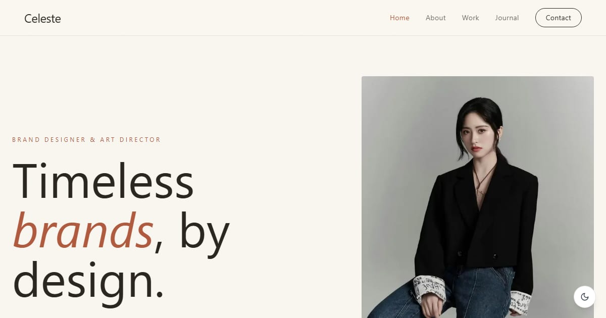

# Celeste — Brand Designer & Art Director

Portfolio template for Celeste, a fictional brand designer and art director: quiet editorial case studies that link to six live demo sites, plus essays on menus, recipe cards, and invitations.

**Demo live:** https://portfolio-celeste-one.vercel.app



> Template portfolio dengan persona fiktif. Semua proyek di dalamnya adalah demo live dari koleksi yang sama; tidak ada klien, testimoni, atau logo merek sungguhan. Formulir kontak hanya demo dan mengatakannya.

## Konsep

Persona fiktif Celeste, desainer merek dan art director. Editorial yang tenang: kertas krem, tinta cokelat tua, aksen terakota, judul serif Playfair Display, dan garis tipis pemisah; mode gelap seperti kertas di bawah lampu redup.

## Isi

- **6 studi kasus** (`/work/[slug]`): tantangan, yang dikerjakan, hasil, dan tautan ke situs live-nya.
- **3 artikel** (`/blog/[slug]`) tentang keputusan desain di proyek-proyek tersebut.
- Angka yang tampil (jumlah proyek, layanan, artikel) dihitung dari isi situs; lama berkarya adalah bagian dari persona fiktif. Tidak ada klaim jumlah klien atau tingkat kepuasan.
- Halaman 404 bergaya sendiri, judul halaman berpola `Halaman — Celeste`, dan sitemap memuat setiap studi kasus dan artikel.

| Studi kasus | Demo live |
| --- | --- |
| Cissy Coffee | https://landing-cissycoffee.vercel.app |
| Rasa Nusantara | https://landing-rasanusantara.vercel.app |
| CitaRasa Digital | https://landing-citarasa.vercel.app |
| Raka & Sinta | https://undangan-wedding-eight.vercel.app |
| Dara Puspita | https://linkinbio-arsip.vercel.app |
| Kopi Vendra | https://linkinbio-vendra.vercel.app |

## Halaman

`/` · `/about` · `/work` · `/work/[slug]` · `/blog` · `/blog/[slug]` · `/contact`

## Gambar & kredit

- `public/images/work/*.webp` — tangkapan layar demo live di tabel atas (karya koleksi ini sendiri).
- `public/images/hero.webp` — "Office Work" oleh Monoar Rahman, [StockSnap](https://stocksnap.io/photo/office-work-DB8D7GBTJH), lisensi CC0.
- `public/images/about.webp` — "Office Work" oleh Châu Thông Phan, [StockSnap](https://stocksnap.io/photo/office-work-BCLRC8HNEO), lisensi CC0.

## Teknologi

- Next.js 15.5 (App Router) dan React 19
- Tailwind CSS v4
- JavaScript
- Framer Motion, Lucide (ikon), next-themes (mode gelap/terang)
- Font: Inter, Playfair Display (next/font)
- SEO: metadata per halaman, Open Graph, JSON-LD (WebSite), sitemap.xml, dan robots.txt

## Menjalankan secara lokal

```bash
npm install
npm run dev
```

Buka http://localhost:3000. Untuk build produksi: `npm run build` lalu `npm start`.

---

Bagian dari koleksi 7 template portfolio personal di [PortalPorto](https://portal-porto-neon.vercel.app). Dibuat oleh [PintuWeb](https://www.pintuweb.com), jasa pembuatan website.
